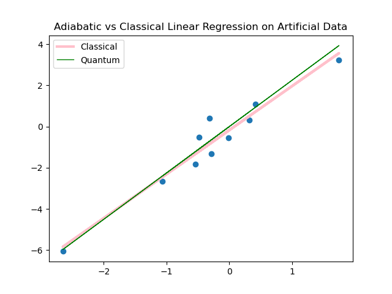
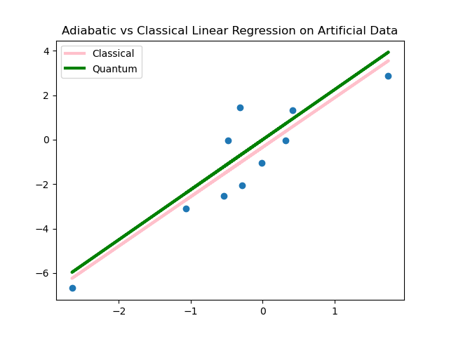

# Overview

The Adiabatic QML repository contains the implementation of a Linear Regression on [DWave Quantum Annealer](https://github.com/dwavesystems) as described in Date, P. and Potok, T. "Adiabatic quantum linear regression". 

 
 

The code implementation is similar to the classical ML frameworks. However, the loss-function optimization has been adapted and implemented in such a way that it could be submitted to DWave Quantum Annealers. The Qauntum Annealer minimizes the loss and returns a distribution of possible linear regressions. The algorithm has been tested on the Simulated Annealing only.

# Usage

The Addiabatic Linear Regression model is used in a similar way as its counterparts avaliable in Scikit-learn framework. The code implementation is avaliable in <annealing_lin_regression.py>, <annealing_optimizer.py> files in <linear> subdirectory.

The following line initializes the model as Addiabatic Linear Regression:

    addiabatic_lin_model = QALinearRegression()

To train the model, run:

    addiabatic_lin_model.train(x, y)

Finally, to make prediction:

    predicted_data = addiabatic_lin_model.predict(x)

*Note:* Given the probabilistic nature of Qauntum Annealers, we have to controll an exta parameter defined as "precision vector" and described in the research paper by P. Date and T. Protok. 

All steps are compossed in <main_for_lin_regr.py> file. To obtain the results of the Quantum Linear Regression, simple execute the code in <main_for_lin_regr.py> file:

    python3  main_for_lin_regr.py

# Results 

Adiabatic Linear Regression Metrics on artificial data set.
    
    Adiabatic Linear Regression R^2 score on training data: 0.9756736682844375

    Sklearn Linear Regression R^2 score on training data: 0.9855625769178462

The following metrics for the Adiabatic Linear Regression were obtained for the test sample.

    MAE of test data is 62.2324098629971.
        
    MSE of test data is 116186.18512068177.
        
    Root MSE of test data is 340.860946898705.
        
    R^2 of test data is 0.8556382431264372.

For comparison, R^2 of the Sklearn Linear Regression on test data is 0.9913720355920954.

# Example and Application

An example of the Adiabatic Linear Regression model application on the real medical data can be found in the [HearAxis repository](https://github.com/elenasuraeva/HeartAxis). The project aims at computing the mean electric axis of the heart on IBM quantum hardaware and making the heart axis prediction using the DWave Quantum Annealers. 

# Disclamer

The code in this repository is distributed on an "AS IS" basis, without any warranties or conditions of any kind. 

The code was tested on a classical CPU as Simulated Annealing algorithm. To submit the code to a quantum hardware, a DWave's cloud API is required. More information could be found in the [dwave-cloud-client](https://docs.ocean.dwavesys.com/en/stable/docs_cloud/sdk_index.html) resource. 

To submit problems to Leap solvers, use a ``dwave-system``solver. More details can be found in the
[Ocean documentation](https://docs.ocean.dwavesys.com/en/stable/index.html).

# License
This work is licensed under the [Apache 2 License](https://www.apache.org/licenses/LICENSE-2.0) and is owned by [DarkStarQuantumLab](https://github.com/DarkStarQuantumLab). 

# References
1. Date, P., Potok, T. Adiabatic quantum linear regression. Sci Rep 11, 21905 (2021). https://doi.org/10.1038/s41598-021-01445-6
